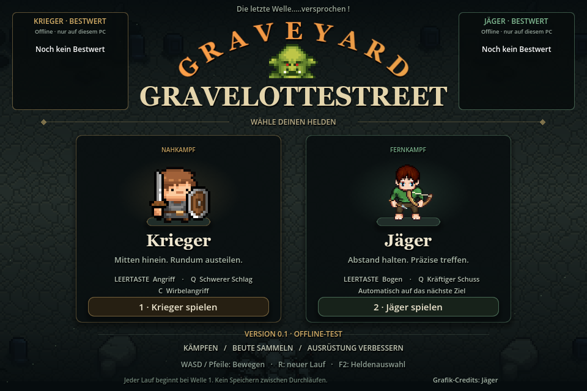

# Graveyard Gravelottestreet

### Die letzte Welle.....versprochen !

**Orks besiegen. Beute sammeln. Waffen aufwerten. Noch eine Runde.**

[**🎮 Windows-Version herunterladen**](https://github.com/Pyrdakor/Graveyard-Gravelottestreet/releases/latest) · [Fehler melden](https://github.com/Pyrdakor/Graveyard-Gravelottestreet/issues)

**Kostenloser Spieltest · Windows 10/11 · Einzelspieler · Pixel-Art · Godot**

## Willkommen auf dem Friedhof

Ein kleines, direktes Hack-and-Slay von **Pyrdakor**: Wähle deinen Helden, überlebe immer gefährlichere Orkwellen und verwandle deine Beute in bessere Ausrüstung. Zwischen den Wellen ist Zeit zum Durchatmen, Verwerten und Aufwerten. Du entscheidest, wann es weitergeht.

## Zwei Helden, zwei Spielweisen

| Krieger | Jäger |
| :--- | :--- |
| Mitten hinein und im Nahkampf austeilen. | Abstand halten und mit dem Bogen treffen. |
| Schwerer Schlag und Wirbelangriff. | Normaler und kräftiger Bogenschuss. |

## Das steckt in Version 0.2.0

- **Wellenkämpfe:** Orks, Bogenschützen, gefährliche Ober-Orks und wachsende Horden.
- **Wechselnde Arenen und Ereignisse:** zufällige Spielflächen, Glatteis und der seltene Rechenfehler.
- **Beute und Aufwertungen:** Schwert- und Bogenvarianten mit sechs Waffenthemen; besondere Effekte ab +5.
- **Rastplätze:** Tasche und Charakterverwaltung zwischen den Wellen sowie vor dem Ober-Ork.
- **Speichern und Fortsetzen:** am Rastplatz unterbrechen und später mit derselben Ausrüstung weiterspielen.
- **Persönliche Bestwerte:** Wie viele Wellen und Orks schaffst du?
- **Starter mit Patcher:** freigegebene Spielversionen automatisch laden und prüfen.

[Alle Patchnotizen und die Sound-Abstimmung](https://github.com/Pyrdakor/Graveyard-Gravelottestreet/releases/tag/v0.2.0)

## In drei Schritten spielen

1. Auf der [Downloadseite](https://github.com/Pyrdakor/Graveyard-Gravelottestreet/releases/latest) unter **Assets** das **Windows-ZIP** herunterladen.
2. Das ZIP **vollständig** in einen eigenen Ordner entpacken.
3. **Graveyard Starter.exe** öffnen und **Spielen** wählen.

Schon Version 0.1 vorhanden? Öffne deinen bisherigen **Graveyard Starter.exe** – er lädt das Update automatisch. Persönliche Bestwerte bleiben erhalten.

Du benötigst **Windows 10/11 (64 Bit)** und für den Starter **.NET Framework 4.7.2 oder neuer**. Godot und Discord müssen nicht installiert sein. Die angebotenen „Source code“-Archive sind **nicht das Spiel**.

## Steuerung

| Taste | Aktion |
| :--- | :--- |
| WASD / Pfeiltasten | Bewegen |
| Leertaste | Angreifen; Ziel wird automatisch gewählt |
| Q | Schwerer Schlag / kräftiger Bogenschuss |
| C | Wirbelangriff des Kriegers |
| E / F / G | Bodenwaffe ausrüsten / verwerten / einpacken |
| Mausrad / + / − | Zoomen; **0** zeigt die Gesamtansicht |
| Esc | Pause, Steuerung und neuer Lauf mit Rückfrage |
| F2 | Zur Charakterauswahl; aktueller Lauf wird verworfen |

**R startet keinen neuen Lauf mehr.** Nach dem Tod stehen **„Neuer Versuch“** und **„Zurück zur Charakterauswahl“** bereit.

## Offline spielen, Updates erhalten

Version 0.2.0 ist eine **frühe Offline-Testversion**. Persönliche Bestwerte bleiben auf deinem PC. Das Spiel überträgt keine Ergebnisse; nur der Starter verbindet sich für Updates mit GitHub. Ohne Internet bleibt die installierte Version spielbar.

**Am Rastplatz „Lauf speichern & beenden“ wählen, später im Menü „Lauf fortsetzen“.** Waffen, Inventar, Bodenbeute und Fortschritt bleiben erhalten. Der Zwischenstand wird beim Fortsetzen verbraucht; zum erneuten Unterbrechen wieder am Rastplatz speichern. Tod oder ungespeichertes Schließen beenden den Versuch. Jeder neue Lauf beginnt bei Welle 1.

Gemeinsame Online-Highscores sind für später geplant und noch nicht enthalten. Inhalte und Balance entwickeln sich mit eurem Feedback weiter.

## Hilf beim Testen

Feedback ist im Projekt-Discord oder als [GitHub-Issue](https://github.com/Pyrdakor/Graveyard-Gravelottestreet/issues) willkommen. Nenne bitte **Spielversion, Klasse und Welle**, beschreibe kurz das Problem und füge nach Möglichkeit einen Screenshot hinzu.

**Danke an alle, die mitspielen und Graveyard Gravelottestreet besser machen!**

## Credits

Entwickelt mit **Godot**. Verwendete Grafiken stammen unter anderem von **Bobddadoo / Tiny Questers**, **CraftPix**, **Kenney** und den Mitwirkenden des **Universal LPC Spritesheet Character Generator**. Vollständige Autoren-, Quellen- und Lizenzhinweise liegen im Download unter **Lizenzen**; Jäger-Credits sind zusätzlich im Spielmenü erreichbar.

Dieses Repository dient der Spielpräsentation sowie Downloads und Updates. Es enthält nicht den Godot-Projektquellcode.
