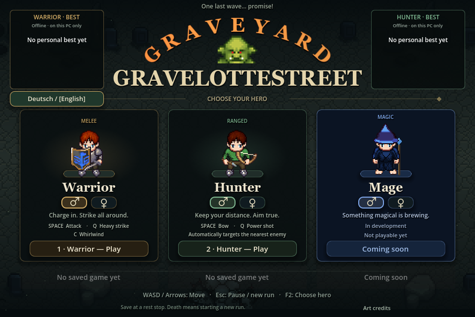

# Graveyard Gravelottestreet

**Die letzte Welle.....versprochen ! / One last wave... promise!**

[🎮 Download Windows 0.3.0](https://github.com/Pyrdakor/Graveyard-Gravelottestreet/releases/tag/v0.3.0) · [Patch notes / Patchnotizen](https://github.com/Pyrdakor/Graveyard-Gravelottestreet/releases/tag/v0.3.0) · [Feedback & bugs](https://github.com/Pyrdakor/Graveyard-Gravelottestreet/issues)

**Kostenloser Offline-Spieltest / Free offline playtest · Windows 10/11 (64-bit) · Single-player · Deutsch / English**

## Deutsch

Ein Pixel-Art-Hack-and-Slay von **Pyrdakor**: Wähle Krieger oder Jäger, überlebe Gegnerwellen, sammle Beute und verbessere deine Waffen. Zwischen den Wellen kannst du in Ruhe ausrüsten, verwerten und speichern.

### Neu in 0.3.0

- **Deutsch / English:** Der Sprachbutton links unter den Bestwerten in der Charakterauswahl schaltet die Spieltexte um. Deine Auswahl wird gespeichert; keine Registrierung oder Online-Übersetzung nötig.
- **Bossschleim nach Welle 10:** Erst Gift spucken, dann gefährliche Sprünge. Seine Lebenspunkte werden vor dem Kampf anhand deines gemessenen Schadens festgelegt. Ziel ist ungefähr eine Minute Kampf – die Balance bleibt im Test.
- **Neue Goblins:** Schwert, Axt und Knüppel sowie Zauberer mit geraden oder im Bogen fliegenden Feuerbällen. Überarbeitete Angriffe, Todesanimationen, Funken und Einschlagseffekte.
- **Ork-Tierhalter und Wolf:** Ab Welle 6 lauert das Duo. Klebetränke bremsen dich; fällt der Wolf, greift der Tierhalter zum Schwert. Der Wolf hat mehr Leben und richtet sich zum Beißen auf.
- **Drei neue Ereignisse:** GEGENWIND schiebt über die Arena; bei Nachspielzeit kehrt die Hälfte der regulären Gegner einmal zurück; bei Gefahrenzulage winkt Beute vom fliehenden Goldgoblin. Ereignisse haben sichtbare Symbole.
- **Mehr Leben am Boden:** dichtes, animiertes Gras und Giftpfützen unter den Figuren.
- **Kosmetische Ausrüstung:** sammelbare Brustteile, Stiefel und beim Krieger Schilde verändern dein Aussehen – ohne zusätzliche Kampfboni.
- **Charaktere und Speicherplätze:** einheitlicherer Pixelstil, getrennte Speicherplätze für Krieger und Jäger und Übernahme älterer Spielstände.

### Spielen und auf Englisch umstellen

1. Auf der Downloadseite unter **Assets** das **Windows-ZIP** herunterladen.
2. Vollständig in einen eigenen Ordner entpacken und **Graveyard Starter.exe** öffnen.
3. In der Charakterauswahl links unter den Bestwerten **[Deutsch] / English** anklicken. Die Sprachwahl bleibt gespeichert.

Bereits dabei? Spiel schließen und den bisherigen Starter öffnen – er lädt das signierte Update. Ohne Internet kannst du die bereits installierte Version weiter spielen. Der Starter benötigt **.NET Framework 4.7.2 oder neuer**; Godot und Discord müssen nicht installiert sein. Die „Source code“-Archive sind nicht das Spiel.

### Speichern und Grenzen

Am Rastplatz **„Lauf speichern & beenden“**, später den Ladebutton unter der passenden Klasse wählen. Ein Speicherplatz je Krieger/Jäger; Geschlechter teilen den Klassenplatz. Beim Fortsetzen wird der Zwischenstand verbraucht. Vor erneutem Beenden wieder speichern; Tod oder ungespeichertes Schließen beendet den Versuch. Ältere Spielstände werden übernommen.

Bestwerte bleiben auf deinem PC. Das Spiel sendet keine Ergebnisse; nur der Starter fragt Updates bei GitHub ab. **Der Magier ist noch nicht spielbar. Der Welle-20-Schamane und seine Totems sind noch nicht enthalten.** Musik und Geräusche bleiben für später vorgesehen.

## English

A pixel-art hack-and-slash by **Pyrdakor**: choose Warrior or Hunter, survive enemy waves, collect loot and upgrade your weapons. Rest stops give you time to equip, salvage and save.

### New in 0.3.0

- **Deutsch / English:** Use the language button below the left personal-best panel on character selection. Your choice is saved; no registration or online translation is needed.
- **Slime boss after wave 10:** Poison spits give way to dangerous jumps. Boss health is set once before the fight using your measured damage. The aim is roughly a minute of combat; balancing is still being tested.
- **New goblins:** Sword, axe and club warriors, plus casters firing straight or arcing fireballs. Improved attacks, death animations, sparks and impact effects.
- **Orc beastmaster and wolf:** Encounter the pair from wave 6. Sticky potions slow you down; once the wolf dies, its master switches to a sword. Wolves have more health and rear up to bite.
- **Three new events:** Wind pushes combatants across the arena; Overtime revives half the regular enemies once; Hazard Pay adds a fleeing golden loot goblin. Events have visible symbols.
- **A livelier arena floor:** dense animated grass and poison puddles drawn beneath characters.
- **Cosmetic equipment:** collect chest pieces, boots and Warrior shields to change your appearance, without extra combat bonuses.
- **Characters and saves:** a more consistent pixel-art style, separate Warrior/Hunter save slots and migration of older saves.

### Play in English

1. Download the **Windows ZIP** from **Assets** on the release page.
2. Extract the entire ZIP to its own folder and open **Graveyard Starter.exe**.
3. On character selection, click **[Deutsch] / English** below the left personal-best panel. Your language choice is saved.

Returning players: close the game and open your existing starter to get the signed update. Your installed version remains playable offline. The starter needs **.NET Framework 4.7.2 or newer**; neither Godot nor Discord needs to be installed. GitHub's source-code archives are not the game.

### Saves and current limits

Choose **Save & quit run** at a rest stop, then load beneath the matching class card. Warrior and Hunter have separate slots; both genders share their class slot. Resuming consumes the suspended save, so save again before leaving. Death or closing without saving ends that attempt. Older saves migrate automatically.

Personal bests stay on your PC. The game does not upload scores; only the starter contacts GitHub for updates. **The Mage is not playable yet. The wave-20 Shaman and its totems are not included.** Music and sound effects are planned for later.

## Steuerung / Controls

| Taste / Key | Deutsch | English |
| :--- | :--- | :--- |
| WASD / Arrows | Bewegen | Move |
| Space | Angriff, automatisches Ziel | Attack, automatic target |
| Q | Schwerer Schlag / kräftiger Schuss | Heavy strike / power shot |
| C | Krieger-Wirbelangriff | Warrior whirlwind |
| E / F / G | Bodenwaffe anlegen / verwerten / einpacken | Equip / salvage / collect ground weapon |
| Mouse wheel / + / − / 0 | Zoom / Gesamtansicht mit 0 | Zoom / full view with 0 |
| Esc | Pause, Steuerung, Neustart mit Rückfrage | Pause, controls, restart confirmation |
| F2 | Charakterauswahl; ungespeicherter Lauf endet | Character selection; unsaved run ends |

## Feedback

Bitte **Version, Klasse und Welle** nennen, gern mit Screenshot. / Please include **version, class and wave**, ideally with a screenshot.

Post in the project Discord or open a [GitHub issue](https://github.com/Pyrdakor/Graveyard-Gravelottestreet/issues). Danke fürs Mitgestalten! / Thanks for helping shape the game!

## Credits

Made with **Godot**. Artwork includes contributions from **CraftPix**, **Bobddadoo / Tiny Questers**, **Kenney**, **Universal LPC Spritesheet Character Generator** contributors and **Yavuz (arsden)**. Full source, author and license details are included under **Lizenzen** in the download; character credits are also accessible in-game. Applicable LPC original images are supplied with their license information.

Dieses Repository enthält Spielpräsentation und Downloads, nicht den Godot-Projektquellcode. / This repository hosts the game's presentation and downloads, not its Godot project source code.
